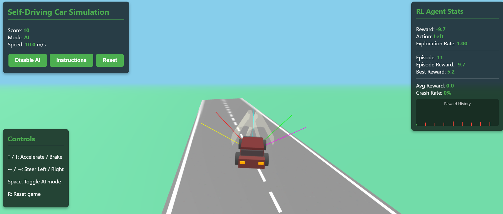

# Interactive Reinforcement Learning Playground

[](https://www.linkedin.com/in/pejman-ebrahimi-4a60151a7/)
[](https://huggingface.co/arad1367)
[](https://arad1367.github.io/pejman-ebrahimi/)
[](https://www.uni.li/pejman.ebrahimi?set_language=en)


A collection of interactive web-based reinforcement learning simulations to help visualize and understand key RL algorithms. These simulations demonstrate fundamental concepts like Q-Learning, Proximal Policy Optimization (PPO), and provide engaging environments for learning about agent-based AI.

## Table of Contents

- [Overview](#overview)
- [Simulations](#simulations)
  - [Q-Learning Grid World](#q-learning-grid-world)
  - [Simple Q-Table Learning](#simple-q-table-learning)
  - [RL Airplane Simulator](#rl-airplane-simulator)
  - [PPO Simulation](#ppo-simulation)
- [Live Demos](#live-demos)
- [Installation & Usage](#installation--usage)
- [Key RL Concepts](#key-rl-concepts)
- [Future Work](#future-work)
- [Contact](#contact)

## Overview

This repository contains four interactive reinforcement learning simulations designed to visualize core RL algorithms and concepts. Each simulation provides a different environment and learning algorithm, allowing users to understand how agents learn to navigate and make decisions in various scenarios.

The simulations are built with vanilla JavaScript and HTML5 Canvas, making them highly accessible across platforms with no dependencies.

## Simulations

### Q-Learning Grid World


An interactive Q-Learning simulation demonstrating how an agent learns to navigate a grid world environment with obstacles to reach a goal state.

**Features:**

- Real-time visualization of the agent's learning process
- Interactive Q-value visualization with arrows indicating action preferences
- Adjustable learning parameters (learning rate, discount factor, exploration rate)
- Performance metrics tracking including episodes, success rate, and average steps
- Learning progress visualization through interactive charts
- Leaderboard for best paths discovered

[Try it live](https://huggingface.co/spaces/arad1367/Q-Learning-Simulation)

### Simple Q-Table Learning


A simplified Q-Learning implementation focused on visualizing the Q-table itself and how values evolve during the learning process.

**Features:**

- 4x4 grid world environment with obstacles
- Clear visualization of the Q-table with best actions highlighted
- Adjustable learning parameters
- Step-by-step or automated training modes
- Learning progress visualization

[Try it live](https://huggingface.co/spaces/arad1367/Q-Table)

### RL Airplane Simulator


A dynamic simulation where an agent learns to control an airplane, maintaining altitude and speed through reinforcement learning.

**Features:**

- 2D physics-based airplane simulation
- Real-time visualization of flight dynamics
- Learning and human control modes
- Adjustable RL parameters
- Performance metrics and flight statistics
- Detailed learning progress log

[Try it live](https://huggingface.co/spaces/arad1367/RL_Airplane_Simulator)

### PPO Simulation


An advanced simulation implementing Proximal Policy Optimization (PPO), a state-of-the-art policy gradient method for reinforcement learning.

**Features:**

- Grid world environment with customizable obstacles
- Visualization of policy probabilities using directional arrows
- Adjustable PPO-specific parameters (clip ratio, learning rate, PPO epochs)
- Policy and value loss tracking
- Detailed explanations of PPO concepts
- Multiple training speeds for visualization

[Try it live](https://huggingface.co/spaces/arad1367/PPO-Simulation)

## Live Demos

All simulations are deployed on Hugging Face Spaces for easy access:

- [Q-Learning Simulation](https://huggingface.co/spaces/arad1367/Q-Learning-Simulation)
- [Q-Table Learning](https://huggingface.co/spaces/arad1367/Q-Table)
- [RL Airplane Simulator](https://huggingface.co/spaces/arad1367/RL_Airplane_Simulator)
- [PPO Simulation](https://huggingface.co/spaces/arad1367/PPO-Simulation)

## Installation & Usage

These simulations are self-contained HTML files that can be run locally without any build process or dependencies.

1. Clone the repository:

```bash
git clone https://github.com/arad1367/Interactive-RL-Playground.git
cd Interactive-RL-Playground
```

2. Open any of the HTML files in a modern web browser:

```bash
# For example, to open the Q-Learning simulation:
open Q-Learning.html
```

3. Interact with the simulation using the provided controls to adjust parameters and observe the learning process.

## Key RL Concepts

These simulations demonstrate several key reinforcement learning concepts:

- **Q-Learning**: A value-based method that learns the quality of actions in states by updating a Q-table using the Bellman equation.
- **Exploration vs. Exploitation**: Balancing random actions (exploration) with known good actions (exploitation) using an epsilon-greedy policy.
- **Proximal Policy Optimization (PPO)**: A policy gradient method that uses a clipped surrogate objective to prevent large policy updates.
- **Reward Functions**: Different simulations use various reward structures to guide agent learning.
- **Learning Parameters**: Adjustable parameters like learning rate, discount factor, and exploration rate to control the learning process.
- **Policy and Value Networks**: Represent the agent's strategy (policy) and estimated values of states.

## Future Work



Future development plans include:

- 3D reinforcement learning simulations using ThreeJS
- Additional algorithms (DQN, A2C, DDPG)
- More complex environments with multi-agent scenarios
- Integration with TensorFlow.js for neural network-based policies
- Downloadable trained models for further experimentation

## Contact

Created by Pejman Ebrahimi

Email: pejman.ebrahimi@uni.li

Feel free to reach out with any questions, suggestions, or collaboration opportunities!

---

© 2025 Pejman Ebrahimi - All Rights Reserved
